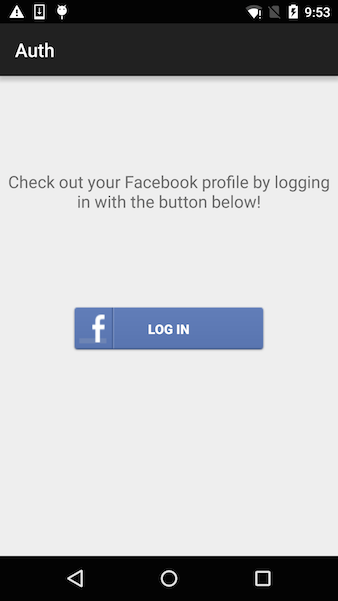
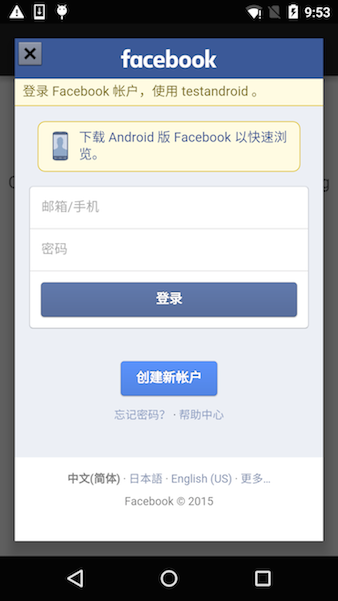
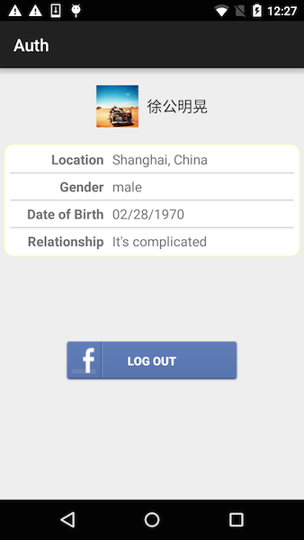

# LAS-Sample-Auth-Android

## 简介

Auth 是 LAS SDK 的一个 Sample，该项目依赖于 LAS 的基础模块。通过该应用你可以学习和了解 基于 LAS SDK 的第三方登录以及如何使用使用 LAS SDK 连接第三方的 SDK。

## 效果

## 前提条件

登录 [Facebook 开发者控制台](https://developers.facebook.com) 创建应用，获取 `FACEBOOK_APP_ID` 和 `FACEBOOK_SECRET_KEY`。

## 使用

1. 打开 Android Studio 或 IDEA ，点击菜单项 `File -> Open ` 选择 `setting.gradle` 文件导入工程
2. 打开 `App.java` 文件，使用你自己的 `APP Id` ，`API KEY`，`FACEBOOK_APP_ID`，`FACEBOOK_SECRET_KEY` 替换该文件中已定义的同名常量。
3. 打开 `strings.xml` 文件，替换 `app_id` 为你的 `FACEBOOK_APP_ID`
4. 登录 LAS 控制台，选择 `Services` - `App Settings` - `User Authentication`，打开 `Allow Facebook authentication`，填入你的 `FACEBOOK_APP_ID` 到 `Facebook Application` 文本框中。
5. 运行应用，点击 LOG IN 按钮，成功登录后会看到对应的用户信息。